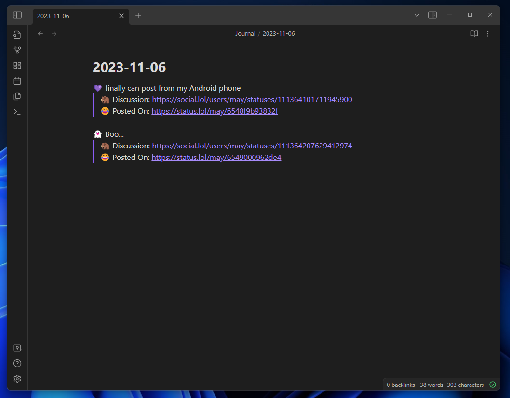
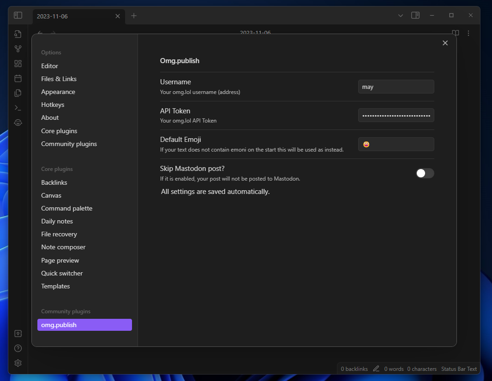

# omg.publish

Omg.publish is a plugin for [Obsidian](https://obsidian.md/) that allows you post notes to [omg.lol](https://omg.lol) services like statuslog or weblog (planned).

## Installation (In progress)

You will need to enable obsidian community plugins in `settings > community plugins` then go to browse and find `omg.publish`

## Plugin Settings

You will need your username and API token from https://home.omg.lol/account (scroll down to bottom). 

You can also change default emoji for cases when you posting text without staring emoji.

If you don't want to cross-post status to mastodon you can enable skip mastodon post settings. This one is by default disabled.

## Publishing text to statuslog

Select any text you want to post to statuslog and open the command palette with `CTRL+P` (Windows) or a similar keyboard shortcut, depending on your operating system. Find for `Post to status log` action.

## Others

The icon I used is from [Font awesome](https://fontawesome.com/icons/face-grin-tears?f=classic&s=regular)

This is a community plugin and is not affiliated with Obsidian or omg.lol.
